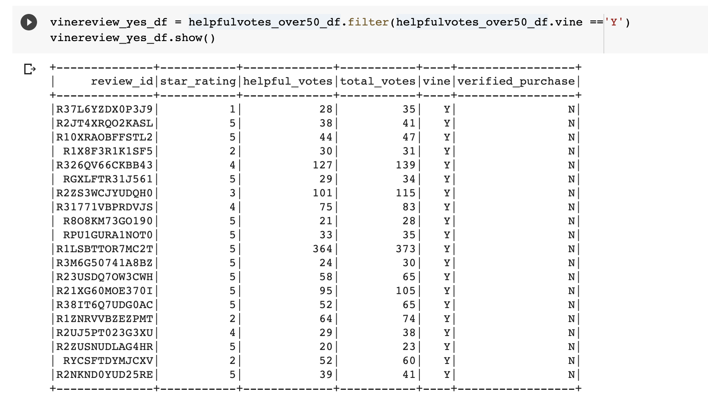

# Amazon_Vine_Analysis

## Overview of the Analysis

The purpose of this project is to process ETL with big data using Pyspark, SQL, and Google Collab to analyze amazon reviews to perform sentiment analysis and see if it’s worth the cost using vine reviews. Therefore, we are calculating the percent of five star reviews for all vine reviews of camera products, and the percent of five star reviews for all non vine reviews 

## Results 

•	The number of vine reviews is 607 and the number of reviews that are not vine reviews is 50,522
•	The percent of 5 star reviews that are vine reviews is 42.339 percent 
•	The percent of 5 star reviews that are not vine reviews is 49.919 percent 

## Summary

In summary, there is not a positive bias for reviews in the vine program. This is because the overall percentage of 5 star reviews that are not vine reviews is greater than the overall percentage of 5 star vine reviews. This leads to the conclusion that it isn’t necessarily a good idea to invest in the vine program.

## Images

DataFrame for Vine Reviews 

DataFrame for Non Vine Reviews 

